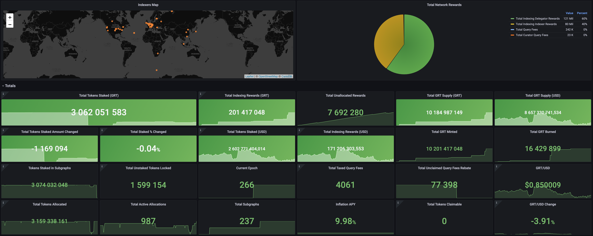

# The Graph: Network Metrics Exporter

The Graph Exporter continuously polls data from the network subgraph, fetches some smart-contract data, and generates network-wide metrics based on collected data.

## Build Docker Image
```
make docker
```

## Run full stack
```
docker-compose up -d
```
### Customize settings
Copy env.example to .env and adjust settings to your environment if needed

## Contributing

Contributions are always welcome!

## License

[MIT](https://choosealicense.com/licenses/mit/)